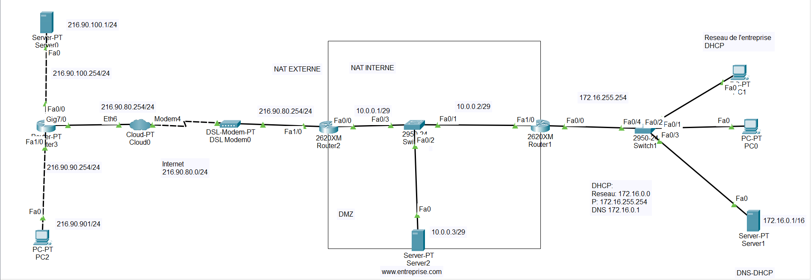

# Rapport de TP — ACL & DMZ

**Étudiant :** Aliou Barry  
**Niveau :** L2  
**Module :** Architecture des Réseaux Sécurisés   
**Année universitaire :** 2025-2026

---

## 1. Introduction

Ce TP a pour objectif de se familiariser avec les Listes de Contrôle d'Accès (ACL) étendues et la mise en place d'une Zone Démilitarisée (DMZ) pour un réseau d'entreprise hébergeant son propre site web, simulé sous Cisco Packet Tracer.

L'architecture mise en place repose sur trois zones distinctes :
- **Internet** : réseau public accessible à tous
- **DMZ** : zone intermédiaire hébergeant le serveur web public (www.entreprise.com)
- **Réseau entreprise** : réseau privé protégé des intrusions extérieures

---

## 2. Topologie du Réseau

### 2.1 Schéma



### 2.2 Plan d'adressage

| Équipement | Interface | Adresse IP | Rôle |
|---|---|---|---|
| Router-PT (internet) | Fa0/0 | 216.90.100.254/24 | Vers Server0 DNS/WEB |
| Router-PT (internet) | Fa1/0 | 216.90.90.254/24 | Vers PC2 Client |
| Router-PT (internet) | Gig7/0 | 216.90.80.252/24 | Vers Cloud-PT |
| Router2 (public) | Fa0/0 | 10.0.0.1/29 | Vers Switch DMZ |
| Router2 (public) | Fa1/0 | 216.90.80.254/24 | Vers DSL Modem |
| Router1 (private) | Fa0/0 | 172.16.255.254/16 | Vers réseau entreprise |
| Router1 (private) | Fa1/0 | 10.0.0.2/29 | Vers DMZ |
| Server0 (DNS/WEB public) | Fa0 | 216.90.100.1/24 | DNS et WEB public |
| Server2 (www.entreprise.com) | Fa0 | 10.0.0.3/29 | Serveur web DMZ |
| Server1 (DNS-DHCP interne) | Fa0 | 172.16.0.1/16 | DNS et DHCP interne |
| PC2 (Client internet) | Fa0 | 216.90.90.1/24 | Client internet |
| PC0, PC1 (entreprise) | Fa0 | DHCP — 172.16.x.x/16 | PCs du réseau interne |

---

## 3. Configuration du Routage et DNS

### 3.1 Routage RIP

Le protocole RIP version 2 a été configuré sur les trois routeurs. Des routes statiques ont été ajoutées entre le routeur internet et Router2 car le Cloud-PT et le DSL Modem ne propagent pas les broadcasts RIP.

**Router-PT (internet)**
```
router rip
 version 2
 network 216.90.100.0
 network 216.90.90.0
 network 216.90.80.0
 no auto-summary

ip route 0.0.0.0 0.0.0.0 216.90.80.254
```

**Router2 (public)**
```
router rip
 version 2
 network 216.90.80.0
 network 10.0.0.0
 no auto-summary

ip route 216.90.90.0 255.255.255.0 216.90.80.252
ip route 216.90.100.0 255.255.255.0 216.90.80.252
```

**Router1 (private)**
```
router rip
 version 2
 network 10.0.0.0
 network 172.16.0.0
 no auto-summary
```

  
*Figure 1 — Interfaces du routeur internet*

  
*Figure 2 — Interfaces de Router2 (public)*

### 3.2 Configuration DNS

Deux serveurs DNS ont été configurés (Split DNS) :

| Serveur DNS | Enregistrement | IP résolue | Utilisé par |
|---|---|---|---|
| Server0 (public) | www.entreprise.com | 216.90.80.253 | PC2 (Client internet) |
| Server1 (interne) | www.entreprise.com | 10.0.0.3 | PC0, PC1 (réseau interne) |

### 3.3 Configuration DHCP

Le serveur DHCP sur Server1 distribue automatiquement les paramètres réseau aux PC0 et PC1 :

| Paramètre | Valeur |
|---|---|
| Pool | entreprise |
| Passerelle par défaut | 172.16.255.254 |
| Serveur DNS | 172.16.0.1 |
| Plage IP | 172.16.0.2 — 172.16.0.51 |
| Masque | 255.255.0.0 |

  
*Figure 3 — Attribution DHCP sur PC1*

---

## 4. Configuration du NAT

### 4.1 NAT Statique

Le NAT statique mappe de façon permanente l'IP privée du serveur web vers son IP publique :

```
ip nat inside source static 10.0.0.3 216.90.80.253

interface fastEthernet 0/0
 ip nat inside

interface fastEthernet 1/0
 ip nat outside
```

  
*Figure 4 — Configuration NAT sur Router2*

  
*Figure 5 — Test NAT statique : PC2 pingue 216.90.80.253 avec succès*

### 4.2 NAT Dynamique (PAT)

Le PAT permet à tous les PCs du réseau entreprise de partager une seule IP publique :

```
access-list 1 permit 172.16.0.0 0.0.255.255
ip nat inside source list 1 interface fastEthernet 1/0 overload
```

Le mot-clé `overload` active le PAT : plusieurs connexions internes sont distinguées par leurs numéros de port.

  
*Figure 6 — Table NAT montrant le PAT en action*

  
*Figure 7 — show ip nat translations sur Router2*

---

## 5. Protection du Réseau Entreprise (ACL)

### 5.1 Logique

Les ACL sont appliquées sur Router1 (private) sur l'interface Fa0/0 côté réseau entreprise :
- **ACL 101 en entrée** : autorise tout le trafic IP sortant depuis 172.16.0.0
- **ACL 100 en sortie** : filtre strictement ce qui entre dans le réseau entreprise

### 5.2 Configuration

**ACL 101 — En entrée (trafic sortant du réseau entreprise)**
```
access-list 101 permit ip 172.16.0.0 0.0.255.255 any
```

**ACL 100 — En sortie (trafic entrant dans le réseau entreprise)**
```
access-list 100 permit tcp any 172.16.0.0 0.0.255.255 established
access-list 100 permit icmp 10.0.0.0 0.0.0.7 172.16.0.0 0.0.255.255
access-list 100 permit icmp any 172.16.0.0 0.0.255.255 echo-reply
```

**Activation sur l'interface**
```
interface fastEthernet 0/0
 ip access-group 101 in
 ip access-group 100 out
```

La règle `established` est fondamentale : elle autorise uniquement les réponses à des connexions initiées depuis l'intérieur. Aucune connexion directe depuis internet vers le réseau entreprise n'est possible.

  
*Figure 8 — ACL configurées sur Router1 (private)*

### 5.3 Tests de validation

| Test | Source | Destination | Résultat attendu | Résultat obtenu |
|---|---|---|---|---|
| PC0 → internet | 172.16.0.x | 216.90.90.1 | ✅ Autorisé | ✅ Succès |
| PC2 → réseau entreprise | 216.90.90.1 | 172.16.0.x | ❌ Bloqué | ❌ Bloqué |

  
*Figure 9 — PC0 vers internet : trafic autorisé*

  
*Figure 10 — PC2 vers réseau entreprise : trafic bloqué*

---

## 6. Protection de la DMZ (ACL)

### 6.1 Logique

La DMZ héberge uniquement le serveur web. Seul le HTTP (port 80) doit être autorisé depuis internet. Tout autre trafic est bloqué.

L'ACL 111 est appliquée en entrée sur Fa1/0 de Router2 (côté internet).

> **Note importante :** L'ACL s'applique AVANT la traduction NAT. La règle HTTP doit donc utiliser l'adresse publique 216.90.80.253 et non l'adresse privée 10.0.0.3.

### 6.2 Configuration

```
access-list 111 permit tcp any host 216.90.80.253 eq 80
access-list 111 permit tcp any 10.0.0.0 0.0.0.7 established
access-list 111 permit icmp any 10.0.0.0 0.0.0.7 echo-reply
access-list 111 permit icmp 172.16.0.0 0.0.255.255 10.0.0.0 0.0.0.7

interface fastEthernet 1/0
 ip access-group 111 in
```

| Règle | Description |
|---|---|
| permit tcp any host 216.90.80.253 eq 80 | Autorise HTTP depuis internet vers le serveur web |
| permit tcp any 10.0.0.0 0.0.0.7 established | Autorise les réponses TCP aux connexions initiées depuis la DMZ |
| permit icmp any 10.0.0.0 0.0.0.7 echo-reply | Autorise les réponses aux pings lancés depuis la DMZ |
| permit icmp 172.16.0.0 0.0.255.255 10.0.0.0 0.0.0.7 | Autorise les pings depuis le réseau entreprise vers la DMZ |

  
*Figure 11 — Configuration ACL 111 sur Router2*

### 6.3 Tests de validation

| Test | Source | Destination | Résultat attendu | Résultat obtenu |
|---|---|---|---|---|
| HTTP depuis PC2 | 216.90.90.1 | http://216.90.80.253 | ✅ Autorisé | ✅ Succès |
| Ping PC2 → Server2 | 216.90.90.1 | 216.90.80.253 | ❌ Bloqué | ❌ Bloqué |
| Ping PC0 → Server2 | 172.16.0.x | 10.0.0.3 | ✅ Autorisé | ✅ Succès |

  
*Figure 12 — PC2 accède au serveur web via HTTP*

  
*Figure 13 — Ping depuis PC2 vers Server2 : bloqué*

  
*Figure 14 — Ping depuis PC0 vers Server2 : autorisé*

---

## 7. Conclusion

### 7.1 Bilan

Ce TP a permis de mettre en place une architecture réseau sécurisée complète comprenant :
- Un routage fonctionnel avec RIP et routes statiques
- Un NAT statique pour exposer le serveur web avec une IP publique
- Un NAT dynamique PAT pour masquer le réseau interne
- Des ACL pour protéger le réseau entreprise de toute intrusion
- Des ACL pour limiter l'accès à la DMZ au seul protocole HTTP

### 7.2 Extension — Ajout d'un serveur FTP

Si le serveur web doit également héberger un serveur FTP, deux règles supplémentaires doivent être ajoutées à l'ACL 111 :

```
access-list 111 permit tcp any host 216.90.80.253 eq 21
access-list 111 permit tcp any host 216.90.80.253 eq 20
```

Le port 21 correspond au canal de contrôle FTP et le port 20 au canal de données.

### 7.3 Récapitulatif

| Section | Tâche | Statut |
|---|---|---|
| 4.2 | Routage RIP + DNS + DHCP | ✅ Terminé |
| 4.3 | NAT Statique + NAT Dynamique PAT | ✅ Terminé |
| 4.4 | ACL protection réseau entreprise | ✅ Terminé |
| 4.5 | ACL protection DMZ | ✅ Terminé |
| 4.6 | Extension FTP | ✅ Terminé |
